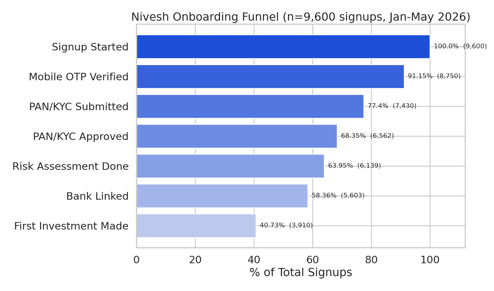
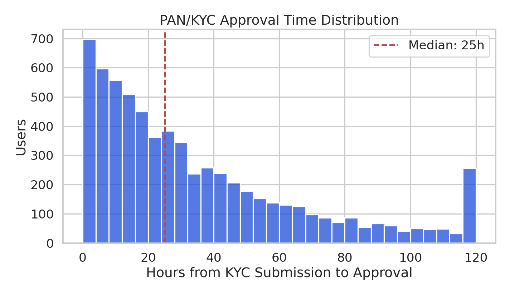
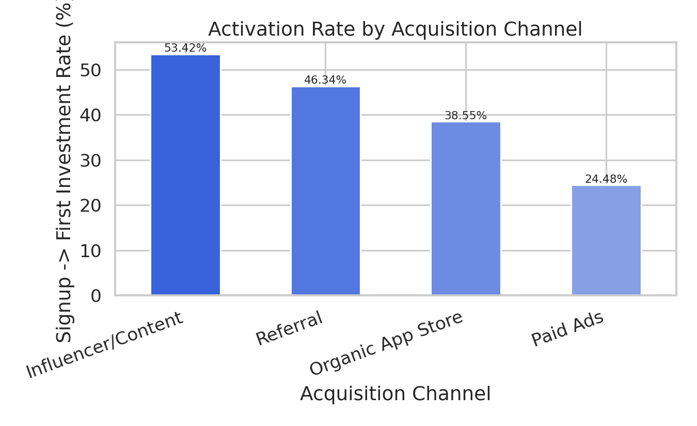
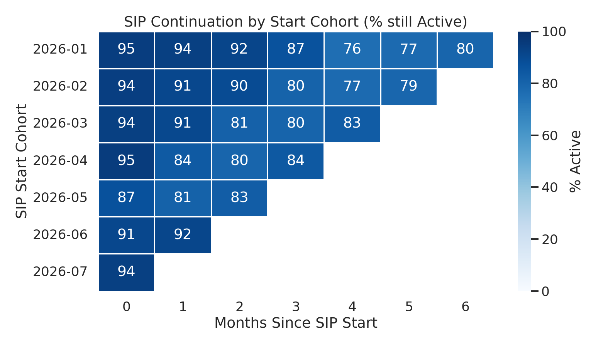
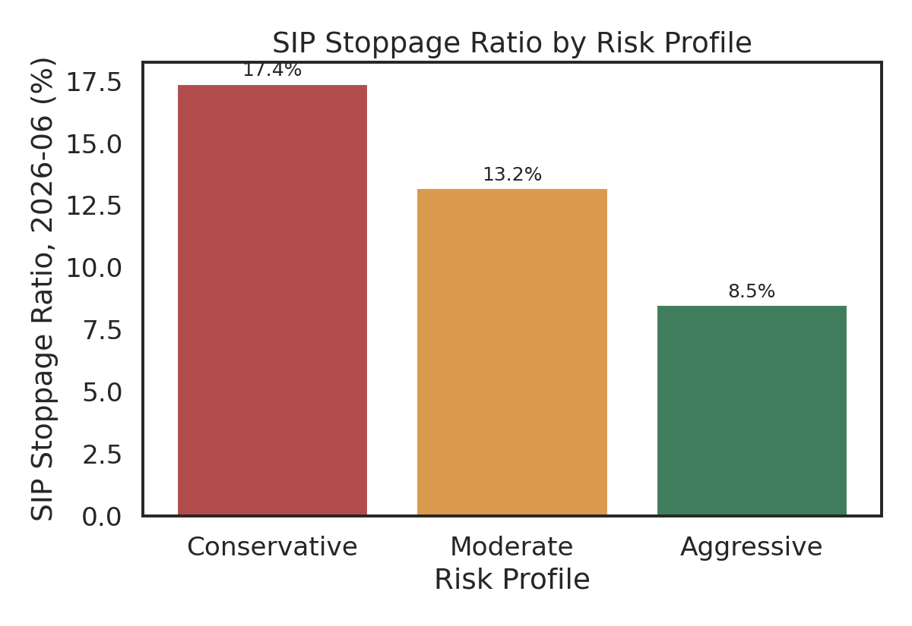
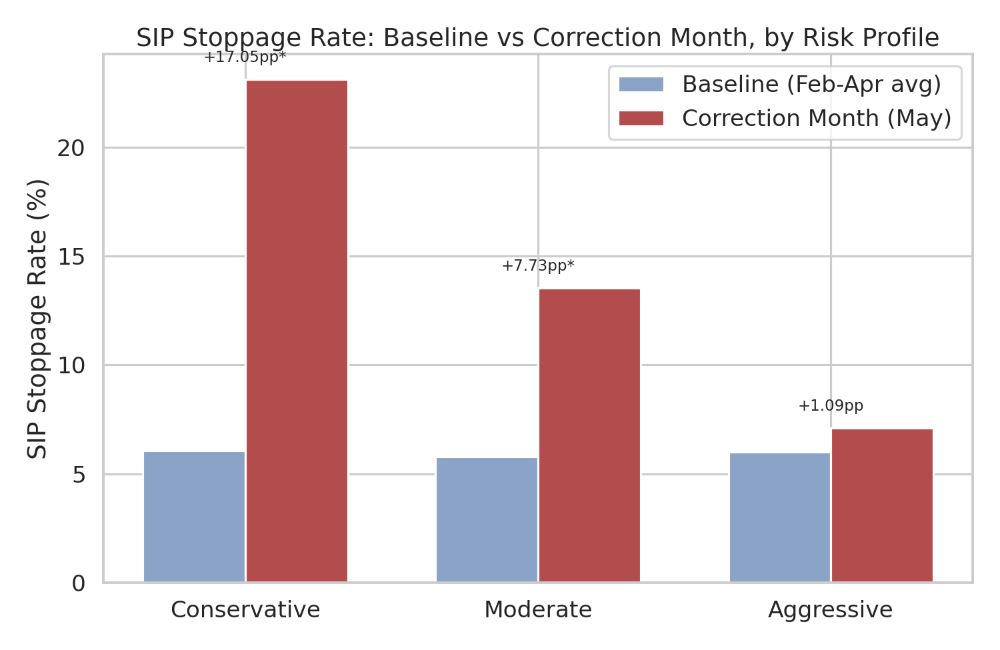
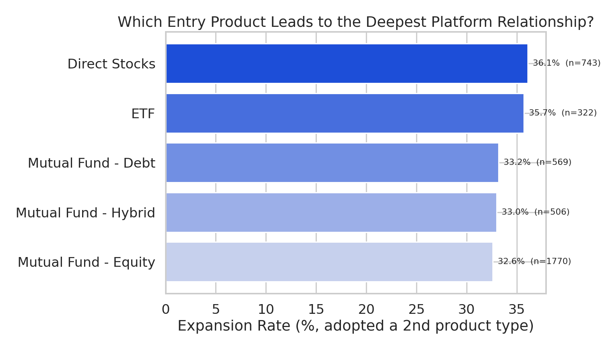
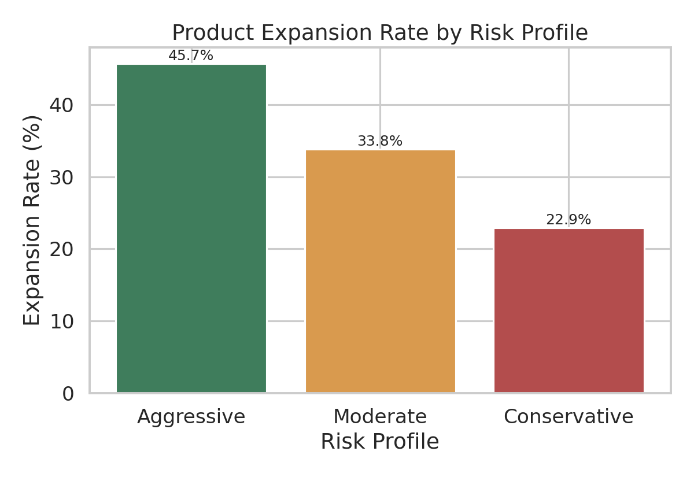

# Nivesh — Investing App(Groww/Zerodha) Product Analytics


Stack: **Python (pandas, numpy, seaborn, scipy) → SQL (BigQuery) → Power BI**

> Same note as the rest of this series: Nivesh is a fictional investing app
> and the dataset is a documented simulation. **One assumption matters more
> here than elsewhere:** the "market correction" this project studies (May
> 2026) is a hypothetical scenario built to analyze behavioral response, not
> real market data — nothing here should be read as an actual 2026 Nifty/
> BSE event. Full detail in [`docs/assumptions.md`](docs/assumptions.md);
> business framing in [`docs/product_thinking.md`](docs/product_thinking.md).

---

## The Business Problem

Nivesh monetizes on assets under management and transaction volume, both of
which depend on two things: getting signed-up users to actually make a
first investment (not trivial — this product asks people to commit money
under real regulatory friction), and keeping them investing consistently
rather than pulling back the moment markets get volatile. This project
looks at both: the first-hour onboarding problem, and the months-later
behavioral-stress problem.

---

## Dataset

| Table | Rows | What it is |
|---|---|---|
| `users.csv` | 9,600 | Signups, Jan–May 2026 |
| `onboarding_events.csv` | ~48,000 | Funnel event log, signup → first investment |
| `investments.csv` | ~5,200 | Investment-level records (first + any expansion investments) |
| `sip_monthly_status.csv` | ~13,200 | Full-population SIP × month panel (Active/Paused/Cancelled) |
| `redemptions.csv` | ~810 | Withdrawal events |

---

## 1. Onboarding Funnel — and Why KYC Needs a Different Fix Than Usual

`scripts/02_onboarding_funnel.py` · `sql/funnel.sql`



| Stage | Users | % of Signups | Step Conversion |
|---|---:|---:|---:|
| Signup Started | 9,600 | 100.0% | — |
| Mobile OTP Verified | 8,750 | 91.2% | 91.2% |
| PAN/KYC Submitted | 7,430 | 77.4% | 84.9% |
| PAN/KYC Approved | 6,562 | 68.3% | 88.3% |
| Risk Assessment Done | 6,139 | 64.0% | 93.6% |
| Bank Linked | 5,603 | 58.4% | 91.3% |
| **First Investment Made** | **3,910** | **40.7%** | 69.8% |

The PAN/KYC approval step converts fine (88.3%) — better than several other
steps in the funnel. **What's different about it is time, not conversion
rate.**



Median time from KYC submission to approval: **25.1 hours**. P75: 49.8
hours. P90: **84 hours** — over three and a half days for one in ten users.
This is a genuine regulatory dependency (PAN verification against
NSDL/CDSL records), not a UX problem the app can just redesign away — which
means the right fix is different too: proactive expectation-setting
("verification typically takes 24–48 hours, we'll notify you") rather than
a funnel-optimization sprint aimed at a step that isn't actually where
people are dropping off in large numbers.



Influencer/content-driven signups activate at **53.4%** — more than double
the **24.5%** for paid ads. Consistent with a well-documented pattern in
Indian fintech: content-driven leads arrive pre-educated about investing
basics, paid clicks don't.

---

## 2. SIP Continuation — the AMFI "Stoppage Ratio" Concept

`scripts/03_sip_continuation_retention.py` · `sql/sip_continuation.sql`

SIP (Systematic Investment Plan) continuity is a real, specifically-Indian
retail-investing metric — AMFI, the mutual fund industry association,
publishes an industry-wide SIP stoppage ratio monthly, because SIPs are how
most of retail India actually invests, and a paused SIP is a broken
recurring commitment, not just a skipped purchase.



The heatmap makes the correction's footprint visible as a diagonal: Jan
cohort dips to 76% at month 4 (May), Feb cohort dips to 80.1% at month 3
(May), Mar cohort to 80.9% at month 2 (May), Apr cohort to 83.7% at month 1
(May) — every cohort's low point lands on the same calendar month
regardless of how long they'd been investing, which is exactly the
signature a real shared market event (not random attrition) would leave.

**Blended continuation curve:**

| Months Since SIP Start | 0 | 1 | 2 | 3 | 4 | 5 | 6 |
|---|---:|---:|---:|---:|---:|---:|---:|
| % Still Active | 92.8% | 88.2% | 84.4% | 82.4% | 79.3% | 78.3% | 79.5% |



June's stoppage ratio (Paused + Cancelled): **17.4% for Conservative
investors vs. 8.5% for Aggressive** — already visible here, and confirmed
properly with a significance test next.

---

## 3. Market Correction Event Study

`scripts/04_market_correction_behavior.py` · `sql/correction_event_study.sql`

Same two-proportion z-test used for the A/B test in project 2, applied here
to an *observational* comparison (baseline months vs. the correction month)
rather than a randomized experiment — an important distinction stated
directly rather than glossed over: this tells us behavior differed, not
that the market drop *caused* it in the strict causal-inference sense
project 3 used for a true randomized-adjacent rollout. For a natural,
unplanned event like a market correction, this is the right and honest
level of claim to make.



| Risk Profile | Baseline Stoppage Rate | Correction Month | Lift | p-value |
|---|---:|---:|---:|---:|
| Conservative | 6.06% | 23.11% | **+17.05pp** | <0.00001 (significant) |
| Moderate | 5.79% | 13.52% | +7.73pp | <0.00001 (significant) |
| Aggressive | 6.01% | 7.10% | +1.09pp | 0.361 (**not significant**) |

This is about as clean a confirmation of loss-aversion behavior as
observational data gets: Conservative investors' SIP stoppage rate nearly
quadrupled during the correction, Moderate investors saw a meaningful but
smaller jump, and Aggressive investors' behavior didn't move by more than
normal month-to-month noise — the difference is statistically
indistinguishable from zero. Redemptions tell the same story (+10.07pp
Conservative, +5.73pp Moderate, +1.00pp not-significant Aggressive).

**This is exactly the segment to build a targeted "don't panic-sell"
communication flow for** — not a blanket app-wide banner, since two-thirds
of the risk-profile base didn't need it.

---

## 4. Product Adoption — Does Retention Alone Miss the Real Story?

`scripts/05_product_adoption_mix.py` · `sql/product_adoption.sql`

A user can be perfectly retained (still investing every month) while never
deepening their relationship with the platform beyond one product — which
retention metrics alone won't catch, but matters a lot for an AUM-driven
business.



Overall expansion rate (adopting a 2nd distinct product type): **33.7%** of
3,910 activated investors. Direct Stocks as a first product leads to the
highest expansion rate (36.1%), though the gap across entry products is
fairly narrow (32.6%–36.1%) — risk profile matters much more:



| Risk Profile | Expansion Rate |
|---|---:|
| Aggressive | **45.7%** |
| Moderate | 33.8% |
| Conservative | 22.9% |

The same trait driving correction-period panic (risk aversion) also
predicts diversification speed in ordinary conditions — Aggressive
investors expand into a 2nd product at nearly double the Conservative
rate. Two independent analyses in this project point at the same
underlying behavioral segment, which is a reassuring consistency check
rather than a coincidence.

The most common next step, given a first product, is largely **toward
Mutual Fund - Equity or Mutual Fund - Debt** regardless of starting point —
worth a look in `data/processed/product_transition_pairs.csv` if you want
the full transition table.

---

## Repo Structure

```
Nivesh-Investing-Product-Analytics/
├── README.md
├── requirements.txt
├── data/
│   ├── raw/
│   └── processed/
├── scripts/
│   ├── 01_generate_data.py
│   ├── 02_onboarding_funnel.py
│   ├── 03_sip_continuation_retention.py
│   ├── 04_market_correction_behavior.py
│   └── 05_product_adoption_mix.py
├── sql/
│   ├── schema.sql
│   ├── funnel.sql
│   ├── sip_continuation.sql
│   ├── correction_event_study.sql
│   └── product_adoption.sql
├── visuals/
├── powerbi/
│   └── POWERBI_GUIDE.md
└── docs/
    ├── assumptions.md
    └── product_thinking.md
```

## Running It

```bash
pip install -r requirements.txt
python scripts/01_generate_data.py
python scripts/02_onboarding_funnel.py
python scripts/03_sip_continuation_retention.py
python scripts/04_market_correction_behavior.py
python scripts/05_product_adoption_mix.py
```

Data generation is deterministic (fixed random seed, verified by hashing
output across separate runs) — running it twice produces byte-identical
CSVs, so the numbers in this README should match exactly.

### SQL
BigQuery Standard SQL, same `YOUR_GCP_PROJECT_ID` placeholder pattern as
the rest of this series.

### Power BI
See [`powerbi/POWERBI_GUIDE.md`](powerbi/POWERBI_GUIDE.md).
